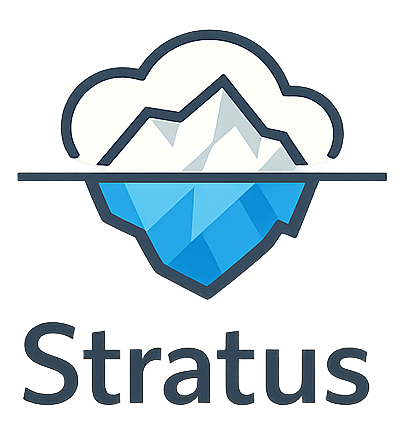

An on-prem data fabric platform built on open standards, governed data lifecycle, and separated compute concerns.

The foundational decision is that **Apache Iceberg is the mandatory table abstraction**. Every analytical dataset — bronze, silver, and gold — is an Iceberg table. Without that constraint the platform degenerates into a file swamp.

## Architecture Overview

```text
                    ┌───────────────────────────────────────────────┐
                    │                 Users / Apps                  │
                    │ BI / SQL / APIs / ML / Data Science / AI     │
                    └───────────────────────────────────────────────┘
                                          │
                         ┌────────────────┴────────────────┐
                         │                                 │
                         ▼               ▼                 ▼
          ┌─────────────────────┐  ┌──────────────┐  ┌──────────────────────┐
          │   Firebolt Core     │  │    Trino     │  │ Spark SQL / Notebook │
          │ low-latency serving │  │ shared query │  │ engineering access   │
          └─────────────────────┘  └──────────────┘  └──────────────────────┘
                         │                 │                 │
                         └─────────────────┴─────────────────┘
                                          │
                                          ▼
                              ┌─────────────────────────┐
                              │   Apache Iceberg Tables │
                              │ bronze / silver / gold  │
                              └─────────────────────────┘
                                          │
                         ┌────────────────┼────────────────┐
                         ▼                ▼                ▼
             ┌──────────────────┐  ┌──────────────────┐  ┌──────────────────┐
             │ Apache Spark     │  │ Apache Flink     │  │ Table Maintenance│
             │ batch ETL / ELT  │  │ streaming / CDC  │  │ compaction etc.  │
             └──────────────────┘  └──────────────────┘  └──────────────────┘
                                          │
                                          ▼
                          ┌───────────────────────────────┐
                          │       Ceph RGW Object Storage │
                          │  raw files + Iceberg data /   │
                          │  metadata files + manifests   │
                          └───────────────────────────────┘

  ┌─────────────────────────────────┐      ┌──────────────────────────────────────┐
  │      Apache Polaris             │      │   Kafka / Kafka Connect / Debezium   │
  │      REST Catalog               │      │   (streaming stage — CDC + events)   │
  │  metadata control plane         │      │                                      │
  │  consulted by all engines       │      │                                      │
  └─────────────────────────────────┘      └──────────────────────────────────────┘

  ┌──────────────────────────────────────────────────────────────────────────────┐
  │ Governance / Control Plane                                                   │
  │ Apache Atlas (JanusGraph + embedded Solr) — metadata, lineage, glossary     │
  │ Apache Ranger — policy enforcement, classification-driven access control     │
  │ Airflow — orchestration, scheduling, promotion gates, maintenance            │
  │ FreeIPA — Kerberos, LDAP, PKI          Keycloak — OIDC for REST services   │
  └──────────────────────────────────────────────────────────────────────────────┘
```

## Core Components

| Component | Role |
|---|---|
| **Ceph RGW** | S3-compatible durable object storage for raw files, Iceberg data and metadata |
| **Apache Iceberg** | Open table format — schema/partition evolution, snapshots, time travel, multi-engine access |
| **Apache Polaris** | Central REST catalog — multi-engine metadata control point for Spark, Flink, Trino |
| **Apache Spark** | Batch ETL/ELT, backfills, historical reprocessing, quality checks, silver/gold materialisation |
| **Apache Flink** | CDC ingestion, event streams, continuous enrichment, near-real-time Iceberg writes |
| **Trino** | Default shared interactive SQL query plane over governed Iceberg datasets |
| **Apache Kafka** | Durable event backbone for CDC and streaming (streaming stage) |
| **Kafka Connect** | Connector framework for source system integration (streaming stage) |
| **Debezium** | CDC connector — captures database change events into Kafka (streaming stage) |
| **Apache Atlas** | Technical metadata catalog, business glossary, lineage, classification, ownership |
| **Apache Ranger** | Policy enforcement — classification-driven access control across all engines |
| **Apache Airflow** | Bounded workflow orchestration, Spark scheduling, promotion gates, table maintenance |
| **FreeIPA** | Linux-native identity provider — Kerberos KDC, LDAP directory, PKI |
| **Keycloak** | OIDC broker for REST-facing services (Polaris, Airflow UI) |
| **OpenBao** | Platform secret store — pull-based service-credential distribution |
| **Prometheus + Grafana** | Metrics collection, dashboards, and alerting |
| **Grafana Loki** | Log aggregation |
| **Firebolt Core** | Optional low-latency SQL serving over curated Iceberg datasets (serving stage) |

**Apache Pulsar** was evaluated as the event backbone and is documented as a qualified alternative rather than adopted. It would gain independent broker/storage scaling, tiered-storage offload onto the existing Ceph RGW cluster, and native multi-tenancy; it would cost a three-part runtime, a second CDC runtime for Oracle and SQL Server, and — because Apache Atlas supports Kafka only for entity change notification — a permanent second messaging system rather than a replacement. The evaluation and its reconsideration triggers are recorded in the architecture document.

## Repository Organization

The monorepo is organized by stable capability, not implementation sequence:

| Directory | Purpose |
|---|---|
| `applications/` | Stratus-owned long-running services |
| `jobs/` | Spark and Flink workloads |
| `verification/` | executable platform conformance suites |
| `platform/` | open-source product integration and deployment assets |
| `environments/` | developer, acceptance, and production inventory and overlays without secrets |
| `operations/` | monitoring, alerting, backup/restore, security, drills, and runbooks |
| `testing/` | cross-component end-to-end and non-functional suites |
| `schemas/` | shared governed event and data contracts |
| `build-support/` | centralized dependency and Maven build policy |
| `docs/` | architecture, decisions, implementation, operations, and reference documentation |
| `scripts/` | repository maintenance tooling (license and copyright headers) |
| `evidence/` | verification and acceptance evidence anchor; generated evidence is not committed |
| `logs/` | git-ignored local Maven build logs, created per workstation |

The authoritative layout table — including the placement rules for new artifacts and the guardrail test that enforces the directory set — is `docs/reference/repository-layout.md`.

The current executable module is the storage conformance verifier in `verification/storage/`. The corresponding Docker/Podman environment is the Ceph Compose cluster in `platform/ceph/compose-cluster/`.

Dependency versions are owned by `build-support/stratus-bom`. Build-plugin versions are owned by `build-support/stratus-build-parent`. Child module POMs do not pin dependency or plugin versions.

## Data Lifecycle

| Zone | Purpose | Typical Producers |
|---|---|---|
| **Bronze** | Raw / lightly normalised, append-biased, source-fidelity data | Batch file landing, CDC feeds, Flink ingestion |
| **Silver** | Conformed, deduplicated, typed, reference-enriched enterprise data | Spark transforms, Flink enrichment |
| **Gold** | Consumption-ready marts, KPIs, aggregates, semantic views | Spark/SQL materialisation |

All three zones are implemented as **Iceberg tables**, not folder conventions.

## Data Quality

The quality subsystem is built entirely from platform components — no additional framework.

- **Spark** executes quality checks as bounded jobs (schema, completeness, uniqueness, freshness, referential integrity, business rules)
- **Iceberg** stores quality results in `platform.quality_check_results` — append-only, permanent audit trail, partitioned by zone and check date
- **Airflow** enforces promotion gates — blocking check failures halt the pipeline
- **Atlas** carries current quality status as a metadata attribute on every dataset
- **Trino** provides ad-hoc query access to quality results

Overrides are explicit, require a named data steward, and are written as auditable records.

## Architecture Principles

1. **Open formats over proprietary lock-in** — Iceberg tables on object storage, not vendor-specific formats.
2. **Storage and table semantics are separated** — Ceph RGW stores files through the S3 API; Iceberg provides the semantic contract.
3. **Streaming and batch are separate compute concerns** — Flink for unbounded streams, Spark for bounded workloads. Engine choice does not decide how data lands: append-only, copy-on-write upsert, merge-on-read upsert, and buffer-then-merge are per-table decisions, defined in the architecture document.
4. **Governance is first-class** — Metadata, lineage, ownership, and classification are built in from day one.
5. **Orchestration is not streaming** — Airflow orchestrates finite workflows; Flink runs continuous pipelines.
6. **Query serving is layered** — Trino is the default open SQL plane; Firebolt is optional acceleration northbound of Iceberg.

## Control Planes

The design explicitly separates three planes:

- **Data Plane** — Ceph RGW, Iceberg tables, Apache Polaris, Spark, Flink, Kafka + Kafka Connect + Debezium, Trino, Firebolt
- **Metadata & Governance Plane** — Atlas, Ranger, glossary, lineage, classification, stewardship
- **Orchestration & Operations Plane** — Airflow, retries, alerts, maintenance scheduling, promotion gates

## Identity and Security

The platform is Linux-only with no Windows dependencies.

- **FreeIPA** — Kerberos authentication, LDAP directory, Dogtag PKI; single identity source of truth
- **Keycloak** — OIDC broker backed by FreeIPA for REST-facing services
- **Ranger** — enforces data access policy backed by FreeIPA groups; tag-based policies driven by Atlas classifications
- **Polaris** — enforces catalog-level access at namespace and table level
- All inter-service communication is TLS; certificates issued by FreeIPA Dogtag PKI

## Delivery Sequence

Each stage leaves the platform in a working, demonstrable state. Later stages build on earlier ones and are not started until the one below is accepted.

| Stage | Delivers | Outcome |
|---|---|---|
| **Foundation** | Ceph RGW, Iceberg, Polaris, Spark, Trino, Airflow, Atlas, Ranger, FreeIPA, Keycloak, bronze/silver/gold | Governed batch lakehouse |
| **Streaming** | Kafka, Kafka Connect, Debezium, Flink, CDC pipelines, Atlas on the platform backbone, lineage automation | Near-real-time ingestion |
| **Serving** | Firebolt Core, curated business marts, semantic views, domain data products | Low-latency consumption |
| **Self-Service** | Policy-driven classification, dataset discovery, domain templates | Scalable operating model |

The foundation stage is the current work. Sequencing detail, work-package IDs, and acceptance gates live in the delivery plans under `docs/implementation/`, not here.

## Key Risks

- **File swamp** — mitigated by mandating Iceberg for all governed datasets.
- **Multi-engine write contention** — mitigated by one-writer-per-table ownership rules and explicit compaction assignment.
- **Governance shelfware** — mitigated by making metadata and lineage publication mandatory in every pipeline.
- **Orchestration sprawl** — mitigated by keeping Airflow focused on finite workflows only.
- **Firebolt too early** — mitigated by keeping it optional until the Iceberg and governance foundations are stable.
- **Atlas operational underestimation** — mitigated by running embedded JanusGraph/BerkeleyDB/Solr in the foundation stage with no external cluster dependencies.

## Running the Platform

The developer harnesses are Compose-based and driven by bash scripts (run them from Git Bash on Windows). The full sequence — prerequisites, start order, every test layer, destructive operations, shutdown, where evidence is written, and troubleshooting — is the harness operations runbook in `docs/operations/`.

The short version:

```bash
# offline regression — the mandatory gate for any change
./mvnw clean verify

# bring up storage, secrets, and catalog (order matters)
bash platform/ceph/compose-cluster/scripts/lifecycle/ceph-compose-startup.sh
bash platform/openbao/compose-service/scripts/lifecycle/openbao-compose-startup.sh
bash platform/ceph/compose-cluster/scripts/verify/ceph-compose-bootstrap-buckets.sh
bash platform/ceph/compose-cluster/scripts/verify/ceph-compose-provision-service-identities.sh
bash platform/polaris/compose-service/scripts/lifecycle/polaris-compose-startup.sh
bash platform/polaris/compose-service/scripts/verify/polaris-compose-bootstrap-catalog.sh

# live conformance suites
bash platform/ceph/compose-cluster/scripts/verify/ceph-compose-run-live-tests.sh
bash platform/polaris/compose-service/scripts/verify/polaris-compose-run-catalog-tests.sh
bash platform/openbao/compose-service/scripts/verify/openbao-compose-run-secrets-tests.sh
```

Live suites are excluded from the default build and select by JUnit tag. Mocks, fakes, and simulated product endpoints are prohibited: product behaviour is proven against the running product.

## Documentation

All documentation lives under `docs/`, organized by kind:

| Directory | Contents |
|---|---|
| `docs/architecture/` | The system architecture and enduring design constraints — the full specification, the component selection decisions, and the write-mode model |
| `docs/decisions/` | Accepted decision records: storage baseline, harness scripting, harness networking, secret distribution, and event backbone selection |
| `docs/implementation/` | Delivery plans and per-capability implementation documents, each carrying its own task track, verification steps, and acceptance gates |
| `docs/operations/` | Operational runbooks, the harness operations runbook, the production-readiness acceptance gate, and dated session handover records |
| `docs/reference/` | Stable references: code style and engineering rules, Maven test and build commands, repository layout |
| `docs/images/` | Image assets referenced by the documents above; no prose lives here |

Start with the architecture for the system design, then the delivery plans for sequencing, then the document for the capability you are working on. Implementation documents are named for their capability — `ceph_storage`, `iceberg_polaris_catalog`, `spark_compute`, `airflow_orchestration`, `trino_query`, `atlas_ranger_governance`, `freeipa_keycloak_identity`, `kafka_event_backbone`, `kafka_connect_debezium_cdc`, `flink_streaming_compute`, `flink_streaming_iceberg`, `atlas_streaming_lineage`, and `streaming_production_readiness`.

### Naming Conventions

Capability documents are named for the capability they describe, for example `ceph_storage.md` rather than `increment1_ceph.md`. Stage and increment identifiers appear only inside plan and tracking documents. Runtime artifacts, Java packages, Maven modules, images, and deployment paths must use stable capability names as well.
