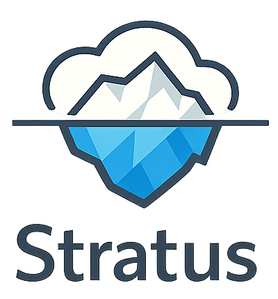

# Stratus

Stratus is an on-premises data fabric built from open standards. It provides a
governed path from source data to analytical products, with separate engines for
batch processing, streaming, orchestration, and query serving.

**Apache Iceberg is the table format for every analytical dataset.** Bronze,
silver, and gold data all use the same table abstraction, which gives the
platform consistent schemas, snapshots, evolution, and multi-engine access.

## Architecture Overview

```text
                    ┌───────────────────────────────────────────────┐
                    │                 Users / Apps                  │
                    │ BI / SQL / APIs / ML / Data Science / AI      │
                    └───────────────────────────────────────────────┘
                                          │
                         ┌────────────────┴────────────────┐
                         │                |                │
                         ▼                ▼                ▼
          ┌─────────────────────┐  ┌──────────────┐  ┌──────────────────────┐
          │   Firebolt Core     │  │    Trino     │  │ Spark SQL / Notebook │
          │ low-latency serving │  │ shared query │  │ engineering access   │
          └─────────────────────┘  └──────────────┘  └──────────────────────┘
                         │                 │                 │
                         └─────────────────┴─────────────────┘
                                          │
                                          ▼
                              ┌─────────────────────────┐
                              │   Apache Iceberg Tables │
                              │ bronze / silver / gold  │
                              └─────────────────────────┘
                                          │
                         ┌────────────────┼────────────────┐
                         ▼                ▼                ▼
             ┌──────────────────┐  ┌──────────────────┐  ┌──────────────────┐
             │ Apache Spark     │  │ Apache Flink     │  │ Table Maintenance│
             │ batch ETL / ELT  │  │ streaming / CDC  │  │ compaction etc.  │
             └──────────────────┘  └──────────────────┘  └──────────────────┘
                                          │
                                          ▼
                          ┌───────────────────────────────┐
                          │       Ceph RGW Object Storage │
                          │  raw files + Iceberg data /   │
                          │  metadata files + manifests   │
                          └───────────────────────────────┘

  ┌─────────────────────────────────┐      ┌──────────────────────────────────────┐
  │      Apache Polaris             │      │   Kafka / Kafka Connect / Debezium   │
  │      REST Catalog               │      │ (streaming capability — CDC/events)  │
  │  metadata control plane         │      │                                      │
  │  consulted by all engines       │      │                                      │
  └─────────────────────────────────┘      └──────────────────────────────────────┘

  ┌──────────────────────────────────────────────────────────────────────────────┐
  │ Governance / Control Plane                                                   │
  │ Apache Atlas — metadata, lineage, glossary, classification, ownership        │
  │ Apache Ranger — policy enforcement, classification-driven access control     │
  │ Airflow — orchestration, scheduling, promotion gates, maintenance            │
  │ FreeIPA — Kerberos, LDAP, PKI          Keycloak — OIDC for REST services     │
  └──────────────────────────────────────────────────────────────────────────────┘
```

## Core Components

| Component | Role |
|---|---|
| **Ceph RGW** | S3-compatible durable object storage for raw files, Iceberg data and metadata |
| **Apache Iceberg** | Open table format — schema/partition evolution, snapshots, time travel, multi-engine access |
| **Apache Polaris** | Central REST catalog — multi-engine metadata control point for Spark, Flink, Trino |
| **Apache Spark** | Batch ETL/ELT, backfills, historical reprocessing, quality checks, silver/gold materialisation |
| **Apache Flink** | CDC ingestion, event streams, continuous enrichment, near-real-time Iceberg writes |
| **Trino** | Default shared interactive SQL query plane over governed Iceberg datasets |
| **Apache Kafka** | Durable event backbone for CDC and streaming |
| **Kafka Connect** | Connector framework for source system integration |
| **Debezium** | CDC connector — captures database change events into Kafka |
| **Apache Atlas** | Technical metadata catalog, business glossary, lineage, classification, ownership |
| **Apache Ranger** | Policy enforcement — classification-driven access control across all engines |
| **Apache Airflow** | Bounded workflow orchestration, Spark scheduling, promotion gates, table maintenance |
| **FreeIPA** | Linux-native identity provider — Kerberos KDC, LDAP directory, PKI |
| **Keycloak** | OIDC broker for REST-facing services (Polaris, Airflow UI) |
| **OpenBao** | Platform secret store — pull-based service-credential distribution |
| **Prometheus + Grafana** | Metrics collection, dashboards, and alerting |
| **Grafana Loki** | Log aggregation |
| **Firebolt Core** | Optional low-latency SQL serving over curated Iceberg datasets |

**Apache Pulsar** remains a documented alternative to Kafka. Its strengths are
independent broker and storage scaling, native multi-tenancy, and tiered storage
on the existing Ceph RGW cluster. Adopting it would also introduce a three-part
runtime, another CDC solution for Oracle and SQL Server, and a small Kafka
deployment for Atlas notifications. The architecture document records the full
assessment and the conditions that would justify revisiting the choice.

## Repository Organization

The monorepo is organized by stable capability:

| Directory | Purpose |
|---|---|
| `applications/` | Stratus-owned long-running services |
| `jobs/` | Spark and Flink workloads |
| `verification/` | executable platform conformance suites |
| `platform/` | open-source product integration and deployment assets |
| `environments/` | secret-free environment inventory and overlays |
| `operations/` | monitoring, alerting, backup/restore, security, drills, and runbooks |
| `testing/` | cross-component end-to-end and non-functional suites |
| `schemas/` | shared governed event and data contracts |
| `build-support/` | centralized dependency and Maven build policy |
| `docs/` | architecture, decisions, implementation, operations, and reference documentation |
| `scripts/` | repository maintenance tooling (license and copyright headers) |
| `evidence/` | verification and operational evidence anchor; generated output is written to ignored local paths |
| `logs/` | git-ignored local Maven build logs, created per workstation |

The full layout, placement rules, and repository guardrail are documented in
`docs/reference/repository-layout.md`.

Maven conformance modules live under `verification/`. Spark's executable tests
are under `platform/spark/tests/`, with packaged workloads under `jobs/spark/`.
Each verification directory corresponds to a stable platform capability.

`build-support/stratus-bom` owns dependency versions, and
`build-support/stratus-build-parent` owns build-plugin versions. Child modules
inherit both sets of versions.

## Data Lifecycle

| Zone | Purpose | Typical Producers |
|---|---|---|
| **Bronze** | Raw / lightly normalised, append-biased, source-fidelity data | Batch file landing, CDC feeds, Flink ingestion |
| **Silver** | Conformed, deduplicated, typed, reference-enriched enterprise data | Spark transforms, Flink enrichment |
| **Gold** | Consumption-ready marts, KPIs, aggregates, semantic views | Spark/SQL materialisation |

All three zones use **Iceberg tables**. Directory layout has no bearing on a
dataset's lifecycle classification.

## Governance, Accountability, and Traceability

Stratus puts governance into the daily operation of the platform so that each dataset
has named owners and stewards. Pipelines record their processing actions and importantly control
decisions identify both the person accountable for the outcome and the person
who approved the evidence.

Central to the design is that lineage must describe where data came from and how it changed through the processing pipelines.
Traceability connects that lineage to evidence about quality, access, approvals,
and responsibility. Useful background reading includes [SAP's data-governance
guide](https://www.sap.com/hk/resources/what-is-data-governance), [Data Dynamics'
traceability glossary](https://www.datadynamicsinc.com/glossary/data-traceability/),
and [Atlan's lineage and traceability
comparison](https://atlan.com/data-lineage-vs-data-traceability/). Stratus's
specific requirements live in the architecture, capability specifications, and
operational controls in this repository.

### 1. Accountability & Ownership

Every Iceberg table, source, pipeline, quality rule, policy, and data product has
a named owner. Team labels help route work and each accountability record ultimately
resolves to an active person or managed group. Atlas holds the dataset `owner`,
`steward`, `domain`, `source`, `zone`, classification, quality status, and latest
snapshot identity. Thereby control records link each change to its owner, approver,
evidence, affected datasets, and policy.

Deployments supply their own names and groups. Each ownership record includes a
contact, escalation route, delegate, and review date. Governance reconciliation
flags records that are stale or no longer resolve through the identity system.

Ownership is assigned at every lifecycle stage:

| Lifecycle stage | Named accountability | Required responsibility and evidence |
|---|---|---|
| Source onboarding and landing | Source-system owner and data steward | Approve purpose, schema contract, sensitivity, retention, expected volume, and landing access; record the source identity and approval. |
| Bronze ingestion | Ingestion/pipeline owner and source-domain steward | Preserve source fidelity, identify the producer and run, quarantine invalid input, and reconcile landed versus written records. |
| Silver conformance | Transformation owner and domain data steward | Own mapping, deduplication, reference data, schema changes, quality rules, and failed-record disposition. |
| Gold products and metrics | Data-product owner and metric/business steward | Approve definitions, fitness for use, consumer expectations, freshness, and material changes to published metrics. |
| Access and query | Security policy owner and dataset steward | Approve least-privilege policy, classifications, exceptions, periodic access review, and allow/deny evidence. |
| Movement, export, or sharing | Pipeline/service owner and receiving steward | Record source, destination, purpose, run identity, transformation, receiving owner, and transfer result. |
| Retention, legal hold, and deletion | Data owner, compliance approver, and storage custodian | Approve retention and hold rules; prove snapshot expiry, object deletion, exceptions, and final disposition; preserve the corresponding audit evidence. |
| Platform operation and recovery | Platform service owner and recovery control approver | Own availability, backup/restore, monitoring, incident response, recovery evidence, and unresolved risk. |

Each table has one active writer. Changes to ownership, schema, policy, quality
overrides, or retention rules carry an approver and a durable record. The full
metadata and enforcement contract is in [the Atlas and Ranger governance
specification](docs/implementation/atlas_ranger_governance.md).

### 2. Compliance & Auditing

Stratus demonstrates the key principles that record the evidence an organisation needs for legal, regulatory, and
internal-control reviews. Compliance also depends on the way each deployment is
configured and operated. Each organization defines the rules that apply to its
deployment, including lawful purpose, retention, consent, data-subject requests,
access reviews, and evidence retention.
Thereby Stratus records who acted, what data they affected, when and why
they acted, which approved process they used, and the outcome:

- **Ranger** records query allow/deny decisions with user, resource, access type,
  timestamp, result, and policy identity.
- **Polaris and Ceph RGW** provide catalog authorization and object-access
  evidence at the storage and metadata boundaries.
- **Airflow** records workflow, task, retry, approval, failure, and promotion-gate
  outcomes under stable run identities.
- **Spark and Flink** emit processing and lineage payloads linking inputs,
  outputs, jobs, code/artifact versions, and run identities.
- **Iceberg** snapshots preserve table-state history, schema evolution, and the
  metadata required to identify which files composed a table state.
- **Atlas** records ownership, classification, glossary, entity, and lineage
  state; governance reconciliation detects missing or stale metadata.
- **Git, change records, and evidence bundles** connect configuration and code
  changes to reviewers, approved artifacts, control results, exceptions, and
  audit evidence.

Audit records are protected operational data. They have access controls,
retention rules, backups, synchronized timestamps, integrity monitoring, and a
tested retrieval process. [Monte Carlo's traceability
overview](https://montecarlo.ai/blog-data-traceability-101) gives broader context
for this kind of lifecycle audit trail. Article 5(2) of the [official EU
regulation](https://eur-lex.europa.eu/eli/reg/2016/679/oj) defines the GDPR
accountability principle.

### 3. Data Integrity & Quality

Quality evidence covers the data as well as the execution. Every result identifies
the dataset, snapshot, rule version, pipeline run, observed value, threshold,
severity, and the owner responsible for resolving it.

- Spark and Flink validate schema, completeness, uniqueness, freshness,
  referential integrity, reconciliation totals, and business rules.
- Results are appended to `platform.quality_check_results`, with distinct states
  for clean, blocking, warning, and missing results.
- Blocking failures stop promotion, and a missing result also fails closed.
- Iceberg snapshots and time travel provide immutable states for before/after
  comparison and investigation.
- Atlas carries the current quality status and latest quality-run identity so
  consumers can see known defects during discovery.
- Overrides require a named steward, reason, scope, expiry, affected snapshot,
  and approval record.

[Atlan's comparison](https://atlan.com/data-lineage-vs-data-traceability/) and
this [DEV Community
overview](https://dev.to/buzzgk/data-traceability-key-concepts-and-best-practices-15f5)
provide additional background on the relationship between lineage and integrity
evidence.

### 4. Lineage Mapping

The required lineage graph follows data from source to consumption:

```text
source system / file / CDC record
  -> landing object or Kafka topic
  -> bronze Iceberg table and snapshot
  -> silver transformation and snapshot
  -> gold product, metric, or semantic view
  -> Trino/serving query, report, API, or downstream product
```

Every edge records the input and output datasets, pipeline or job, immutable code
or artifact version, `run_id`, event time, processing time, and outcome. Dataset
and process lineage is required for every pipeline. Column-level lineage is added
when the transformation can produce it reliably. Spark and Flink share the same
lineage contract, and Atlas reconciliation keeps batch, streaming, and CDC
metadata aligned.

Retries, backfills, compaction, snapshot expiry, replay, and recovery all preserve
the logical processing history. Maintenance can replace physical files while the
dataset history and accountable processing chain remain intact. Related
background is available from [Vanta](https://www.vanta.com/collection/grc/data-governance),
[Data Dynamics](https://www.datadynamicsinc.com/glossary/data-traceability/), and
[Hyperbots](https://www.hyperbots.com/glossary/data-traceability).

## Data Quality

The quality subsystem uses the same components that run and govern the data
platform:

- **Spark** executes quality checks as bounded jobs (schema, completeness, uniqueness, freshness, referential integrity, business rules)
- **Iceberg** stores quality results in `platform.quality_check_results` — append-only durable evidence, partitioned by zone and check date and retained under approved policy
- **Airflow** enforces promotion gates — blocking check failures halt the pipeline
- **Atlas** carries current quality status as a metadata attribute on every dataset
- **Trino** provides ad-hoc query access to quality results

Overrides are explicit, require a named data steward, and are written as auditable records.

## Architecture Principles

1. **Use open formats** — Iceberg tables on object storage keep the data portable across engines.
2. **Separate storage from table semantics** — Ceph RGW stores files through the S3 API, while Iceberg manages schemas, snapshots, partitions, and table history.
3. **Choose compute for the workload** — Flink handles unbounded streams and Spark handles bounded work. Each table independently chooses append, copy-on-write upsert, merge-on-read upsert, or buffer-then-merge.
4. **Build governance into the workflow** — Metadata, lineage, ownership, and classification travel with each dataset from onboarding onward.
5. **Give orchestration and streaming clear jobs** — Airflow coordinates finite workflows; Flink operates continuous pipelines.
6. **Layer query serving** — Trino provides the shared SQL plane, with Firebolt available when curated Iceberg data needs lower-latency serving.

## Control Planes

Stratus groups runtime responsibilities into three planes:

- **Data Plane** — Ceph RGW, Iceberg tables, Apache Polaris, Spark, Flink, Kafka + Kafka Connect + Debezium, Trino, Firebolt
- **Metadata & Governance Plane** — Atlas, Ranger, glossary, lineage, classification, stewardship
- **Orchestration & Operations Plane** — Airflow, retries, alerts, maintenance scheduling, promotion gates

## Identity and Security

Production services run on Linux. Windows workstations use Git Bash and a Linux
container engine for local development, so the same service runtime is exercised
in both environments.

Production uses the following identity and policy services:

- **FreeIPA** — Kerberos authentication, LDAP directory, Dogtag PKI; authoritative identity service
- **Keycloak** — OIDC broker backed by FreeIPA for REST-facing services
- **Ranger** — enforces data access policy backed by FreeIPA groups; tag-based policies driven by Atlas classifications
- **Polaris** — enforces catalog-level access at namespace and table level
- All inter-service communication is TLS; certificates issued by FreeIPA Dogtag PKI

## Key Risks

- **Unmanaged files** — every governed dataset uses Iceberg and is registered through the catalog.
- **Multi-engine write contention** — each table has one writer and an explicitly assigned compaction owner.
- **Incomplete governance metadata** — every pipeline publishes metadata and lineage, with reconciliation to find gaps.
- **Orchestration sprawl** — Airflow's scope is finite workflow coordination.
- **Premature query acceleration** — Firebolt remains optional until workload evidence justifies it.
- **Atlas operating complexity** — the developer profile uses embedded dependencies; production planning covers HBase, SolrCloud/ZooKeeper, notification Kafka, backup and restore, capacity, and recovery.

## Running the Platform

Developer environments use Compose and Bash. On Windows, run the scripts from
Git Bash. The harness operations runbook under `docs/operations/` covers
prerequisites, startup order, test layers, destructive operations, shutdown,
evidence locations, and troubleshooting.

A typical local run looks like this:

```bash
# offline regression — required for every change
./mvnw clean verify

# bring up storage, secrets, and catalog (order matters)
bash platform/ceph/compose-cluster/scripts/lifecycle/ceph-compose-startup.sh
bash platform/openbao/compose-service/scripts/lifecycle/openbao-compose-startup.sh
bash platform/ceph/compose-cluster/scripts/verify/ceph-compose-bootstrap-buckets.sh
bash platform/ceph/compose-cluster/scripts/verify/ceph-compose-provision-service-identities.sh
bash platform/polaris/compose-service/scripts/lifecycle/polaris-compose-startup.sh
bash platform/polaris/compose-service/scripts/verify/polaris-compose-bootstrap-catalog.sh

# batch compute, optional — a consumer of the three above
./mvnw -pl :stratus-spark-jobs -am package -DskipTests
bash platform/spark/compose-cluster/scripts/lifecycle/spark-compose-startup.sh
bash platform/spark/compose-cluster/scripts/verify/spark-compose-bootstrap-principal.sh

# live conformance suites
bash platform/ceph/compose-cluster/scripts/verify/ceph-compose-run-live-tests.sh
bash platform/polaris/compose-service/scripts/verify/polaris-compose-run-catalog-tests.sh
bash platform/openbao/compose-service/scripts/verify/openbao-compose-run-secrets-tests.sh
bash platform/spark/compose-cluster/scripts/tests/spark-compose-run-live-tests.sh
```

The default Maven build runs the offline suite. JUnit tags select live suites,
which exercise the actual running products and their public interfaces.

## Documentation

Documentation under `docs/` is grouped by purpose:

| Directory | Contents |
|---|---|
| `docs/architecture/` | The system architecture and enduring design constraints — the full specification, the component selection decisions, and the write-mode model |
| `docs/decisions/` | Architecture decision records: storage baseline, harness scripting, harness networking, secret distribution, and event backbone selection |
| `docs/implementation/` | Per-capability implementation, configuration, verification, and operating specifications |
| `docs/operations/` | Operational runbooks, harness operation, monitoring, recovery, and production-readiness controls |
| `docs/reference/` | Stable references: code style and engineering rules, Maven test and build commands, repository layout |
| `docs/images/` | Image assets referenced by the documents above |

Start with the architecture for the overall system, then open the specification
for the capability you are changing. Implementation documents use capability
names such as `ceph_storage`, `iceberg_polaris_catalog`, `spark_compute`,
`airflow_orchestration`, `trino_query`, `atlas_ranger_governance`,
`freeipa_keycloak_identity`, `kafka_event_backbone`,
`kafka_connect_debezium_cdc`, `flink_streaming_compute`,
`flink_streaming_iceberg`, `atlas_streaming_lineage`, and
`streaming_production_readiness`.

### Naming Conventions

Capability documents are named for the capability they describe, for example
`ceph_storage.md`. Runtime artifacts, Java packages, Maven modules, images, and
deployment paths use the same stable capability names.
